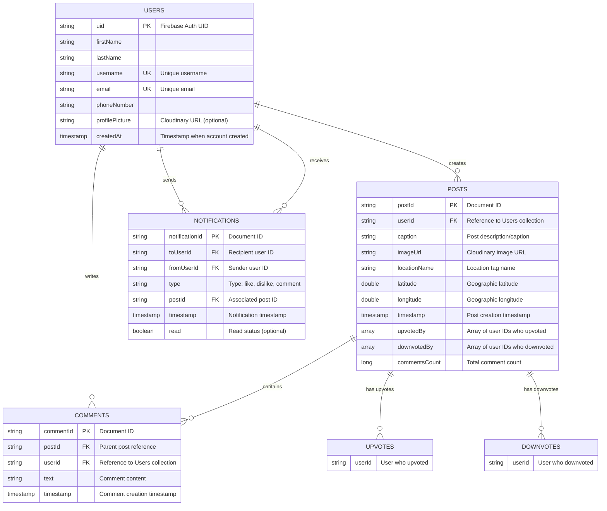

# MORS - Entity Relationship Diagram

## Database Schema Overview

The MORS application uses **Firebase Firestore** as its backend database with a NoSQL document-based structure. Below is the complete Entity Relationship Diagram showing all collections, their fields, and relationships.

---

## ER Diagram (Mermaid)



---

## Collection Definitions

### 1. **USERS Collection**
Stores user account information and profile data.

| Field | Type | Description | Constraints |
|-------|------|-------------|-------------|
| `uid` | String | Firebase Authentication UID | Primary Key, Auto-generated |
| `firstName` | String | User's first name | Required |
| `lastName` | String | User's last name | Required |
| `username` | String | Unique username display name | Required, Unique Index |
| `email` | String | User's email address | Required, Unique Index |
| `phoneNumber` | String | User's phone number | Optional |
| `profilePicture` | String | Cloudinary image URL | Optional |
| `createdAt` | Timestamp | Account creation timestamp | Auto-set |

**Document ID:** Firebase Auth UID (uid)

**Example Document:**
```json
{
  "uid": "user123abc",
  "firstName": "John",
  "lastName": "Doe",
  "username": "johndoe",
  "email": "john@example.com",
  "phoneNumber": "+1234567890",
  "profilePicture": "https://cloudinary.com/johndoe.jpg",
  "createdAt": "2026-04-15T10:30:00Z"
}
```

---

### 2. **POSTS Collection**
Stores user-generated posts with media, location, and interaction data.

| Field | Type | Description | Constraints |
|-------|------|-------------|-------------|
| `postId` | String | Unique post identifier | Primary Key, Auto-generated |
| `userId` | String | Reference to post creator | Foreign Key → USERS.uid |
| `caption` | String | Post description/caption | Required |
| `imageUrl` | String | Cloudinary media URL | Required |
| `locationName` | String | Human-readable location name | Optional |
| `latitude` | Double | Geographic latitude | Optional |
| `longitude` | Double | Geographic longitude | Optional |
| `timestamp` | Timestamp | Post creation time | Server-set |
| `upvotedBy` | Array | List of user IDs who upvoted | Indexed for queries |
| `downvotedBy` | Array | List of user IDs who downvoted | Indexed for queries |
| `commentsCount` | Long | Denormalized comment count | For performance |

**Document ID:** Auto-generated by Firestore

**Subcollections:**
- `comments` - Contains comment documents for this post

**Example Document:**
```json
{
  "userId": "user123abc",
  "caption": "Beautiful sunset at the beach!",
  "imageUrl": "https://cloudinary.com/post_images/sunset.jpg",
  "locationName": "Location Tagged",
  "latitude": 40.7128,
  "longitude": -74.0060,
  "timestamp": "2026-04-20T15:45:00Z",
  "upvotedBy": ["user456def", "user789ghi"],
  "downvotedBy": ["user012jkl"],
  "commentsCount": 5
}
```

---

### 3. **POSTS > COMMENTS Subcollection**
Stores comments on individual posts.

| Field | Type | Description | Constraints |
|-------|------|-------------|-------------|
| `commentId` | String | Unique comment identifier | Primary Key, Auto-generated |
| `postId` | String | Parent post ID | Foreign Key → POSTS.postId |
| `userId` | String | Comment author | Foreign Key → USERS.uid |
| `text` | String | Comment content | Required, Max 500 chars |
| `timestamp` | Timestamp | Comment creation time | Server-set |

**Parent Path:** `/posts/{postId}/comments`

**Document ID:** Auto-generated by Firestore

**Example Document:**
```json
{
  "userId": "user456def",
  "text": "Amazing photo! 🌅",
  "timestamp": "2026-04-20T16:10:00Z"
}
```

---

### 4. **NOTIFICATIONS Collection**
Stores user notifications for interactions (likes, dislikes, comments).

| Field | Type | Description | Constraints |
|-------|------|-------------|-------------|
| `notificationId` | String | Unique notification ID | Primary Key, Auto-generated |
| `toUserId` | String | Recipient user ID | Foreign Key → USERS.uid |
| `fromUserId` | String | Sender user ID | Foreign Key → USERS.uid |
| `type` | String | Notification type | Enum: "like", "dislike", "comment" |
| `postId` | String | Associated post ID | Foreign Key → POSTS.postId |
| `timestamp` | Timestamp | Notification creation time | Server-set |
| `read` | Boolean | Read status | Optional, Default: false |

**Document ID:** Auto-generated by Firestore

**Indexes:** Query by `toUserId` and `timestamp` (sorted descending)

**Example Document:**
```json
{
  "toUserId": "user123abc",
  "fromUserId": "user456def",
  "type": "like",
  "postId": "post789xyz",
  "timestamp": "2026-04-20T16:05:00Z",
  "read": false
}
```

---

## Key Relationships

### 1. **User Creates Posts** (One-to-Many)
- A single user can create multiple posts
- `POSTS.userId` → `USERS.uid`
- Query: `db.collection("posts").whereEqualTo("userId", userId)`

### 2. **Post Has Comments** (One-to-Many, Subcollection)
- A single post can have many comments
- Comments stored as subcollection: `/posts/{postId}/comments`
- Query: `db.collection("posts").document(postId).collection("comments")`

### 3. **User Interacts with Posts** (Many-to-Many)
- Users can upvote/downvote posts
- Stored as arrays in POSTS collection: `upvotedBy[]`, `downvotedBy[]`
- Check if user voted: `userId in upvotedBy || userId in downvotedBy`

### 4. **User Receives Notifications** (One-to-Many)
- A user receives notifications from others' interactions
- Query: `db.collection("notifications").whereEqualTo("toUserId", userId).orderBy("timestamp", DESCENDING)`

### 5. **Post Creation Flow**
```
User signs up → Document created in USERS
User creates post → Document created in POSTS with userId reference
Post gets interaction → Document created in NOTIFICATIONS
User comments → Document created in POSTS > COMMENTS subcollection
```

---

## Database Constraints & Indexes

### Unique Indexes (Recommended)
```
Collection: USERS
- Field: email (ascending)
- Field: username (ascending)
```

### Composite Indexes
```
Collection: NOTIFICATIONS
- Fields: toUserId (ascending), timestamp (descending)

Collection: POSTS
- Fields: userId (ascending), timestamp (descending)

Collection: POSTS > COMMENTS
- Fields: timestamp (ascending)
```

### Security Rules Considerations
```
- Users can only read/write their own profile
- Posts are readable by all authenticated users
- Users can only create comments on existing posts
- Notifications are user-specific and read-only by recipient
```

---

## Data Flow Diagram

```
┌─────────────┐
│   Firebase  │
│   Auth      │
└──────┬──────┘
       │ (Creates UID)
       ▼
┌──────────────────┐
│  USERS           │
│  Collection      │
│  (Profile Data)  │
└──────┬───────────┘
       │
       ├──────────────────┬────────────────┐
       │                  │                │
       ▼                  ▼                ▼
   ┌─────────────┐  ┌──────────────┐  ┌──────────────────┐
   │ POSTS       │  │ COMMENTS     │  │ NOTIFICATIONS    │
   │ Collection  │  │ Subcollection│  │ Collection       │
   │ (Media)     │  │ (Feedback)   │  │ (Interactions)   │
   └─────────────┘  └──────────────┘  └──────────────────┘
       │                │                   │
       │ (Contains)     │ (In Post)         │ (About Post)
       │                │                   │
       └────────────────┴───────────────────┘
                 │
         ┌───────▼────────┐
         │ User Actions   │
         │ (Like/Dislike) │
         └────────────────┘
```

---

## Firestore Pricing Impact

- **Reads**: Heavily used for feed queries and user lookups
- **Writes**: Post creation, comment addition, vote operations
- **Deletes**: Post deletion
- **Recommendations**:
  - Use pagination for feed queries
  - Implement caching in app
  - Consider Cloud Functions for complex operations
  - Monitor denormalized fields like `commentsCount`

---

## Notes

- All timestamps are Firestore server timestamps for consistency
- Media URLs point to Cloudinary CDN for image hosting
- Location data stored as lat/long for future map features
- Upvote/downvote arrays allow quick checks but have limits for very popular posts (use counters for large-scale)

